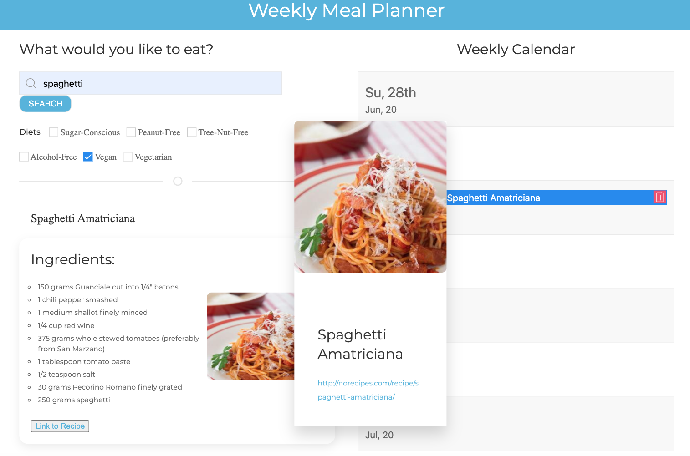

# Weekly Meal Planner

Weekly Meal Planner

As a health-conscious person with a busy schedule, 
I want to be able to look up recipes and be able to add them to my calendar
so that I can plan my weekly meal plans.

Delivered using:

UIKit
Edamam API
Google Calendar API

Search bar allows for up to 100 recipes

The results are displayed in an accordion that has the ingredients, a picture, and the link to the recipe.

A calendar button allows the user to add it to their calendar. 

## Here's a link to the deployed page through Herkou: 
https://hollyisaredhead.github.io/Weekly-meal-planner/

-------------------------------------------

